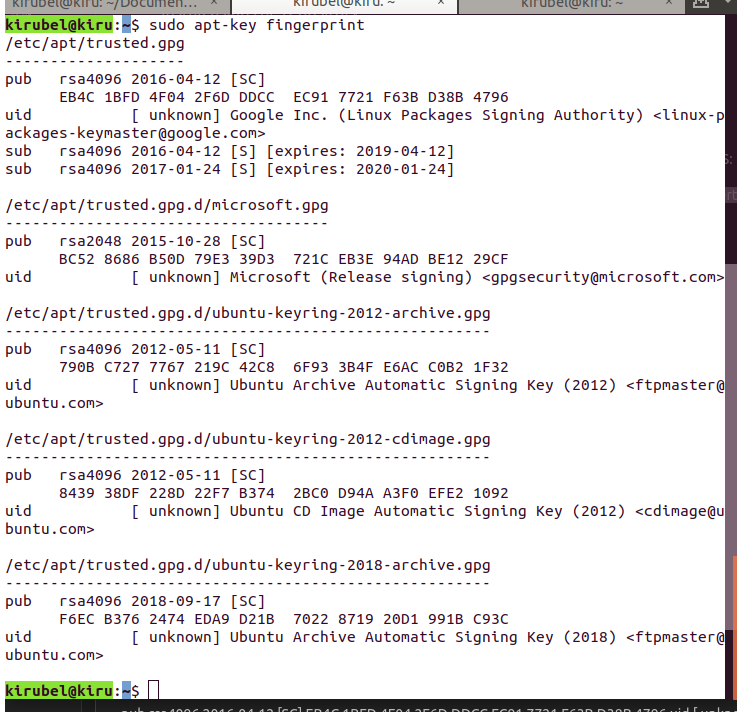
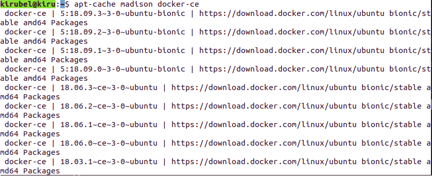
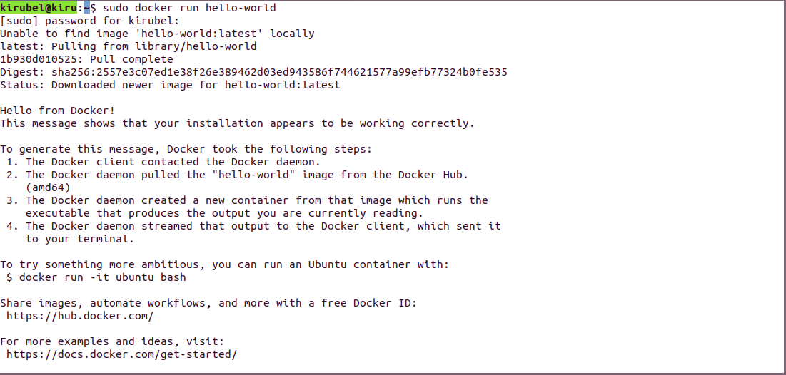
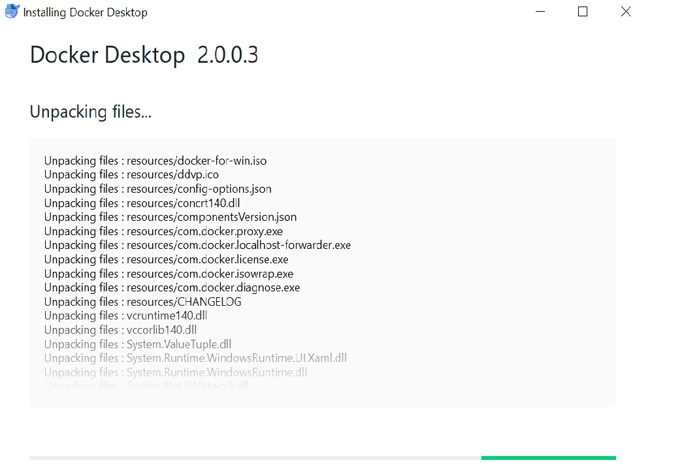

Author: Arun & Kirubel, Date: 20.03.2019,Training Material
# Getting started with the App IDE
## Introduction 
(Write the context of Kuksa - APPSATCLE Project Max 7 sent)
Kuksa IDE is an open source developer workspace and Cloud IDE. The Kuksa IDE is a full custom build based on the Eclipse Che. 
(Write about Kuksa IDE from Che components)
The development of software-intensive automotive systems by the Origional Equipment Manufuctureres (OEM) still has unresolved challanges. Therefore, development of standardized car-to-cloud senario could improve the activities and invites external applications, service providor and use of open-source software. A platform such as: the Eclipse [Kuksa](https://www.eclipse.org/kuksa/), which is based on the APPSTACLE project which itself is part of the Europian ITEA3 program provides mobility as a service as well as after-sales innovations and the means to catch up with the fastly growing of software in changing the business in connected cars. Kuksa is a secure and open automotive platform built as a full custom Eclipse Che Assembly. [Eclipse Che](https://en.wikipedia.org/wiki/Eclipse_Che) is an open-source java based integrated developer inveronment as cloude, and server which provides a mult-user remote development platform. It consists of a Software Development Kit (SDK) to allow application for certain software packages, framework, platform or computer systems by allowing to create plug-ins for those frameworks,languages or tools.
### Getting started with the App IDE
[Kuksa is divided into a series of components](https://wiki.eclipse.org/Kuksa): 

*InVehicle*, *AGL build scripts*, *IDE*, *Cloud*, *Integration*, *Apps*, *[Website](https://projects.eclipse.org/projects/iot.kuksa)*. Each of these components will be discussed in details. 
### Installing Docker for Ubuntu
* Check the Ubuntu version using the command . 
* To Get the Comunity Edition (Docker CE) version for ubuntu, make sure you have 64-bit version of Ubuntu. 
    * Cosmic 18.10
    * Bionic 10.04 (LTS)
    * Xenial 16.04 (LTS)
* Docker CE is supported on ```x86_64 (or amd64), armhf, arm64, s390x``` (IBM Z), and ```ppc64le``` (IBM Power) architectures.
* Uninstall older Docer version using: 
   ```$ sudo apt-get remove docker docker-engine docker.io containerd runc``` 
* The supported storage drives for Docker CE on Ubuntu are : *overlay2*, *aufs* and *btrfs*.
* Depending on the needs, Docker CE can be installed in different ways: 
    * For ease installation and upgrade task (Recomended) use [set up Docker's repositories](https://docs.docker.com/install/linux/docker-ce/ubuntu/#install-from-a-package).
    * For manual installation and upgrading, use [install it manually](https://docs.docker.com/install/linux/docker-ce/ubuntu/#install-from-a-package). Which might be useful in situations as installing Docker on air-gapped systems with no access to the internet.
    * For testing and development purpose, use automated [convenience scripts](https://docs.docker.com/install/linux/docker-ce/ubuntu/#install-using-the-convenience-script) to install Docker.
  
## Install using the repository
Set up the Docker repository by following the steps:
1. Update the <span style="color:lightblue">apt</span> pakage index    
          ```$ sudo apt-get update```

2. Coppy and paste the following line of command to allow <span style="color:lightblue">apt</span> to use repository over HTTPS:
   
   ```sudo apt-get install \apt-transport-https \```

   ```ca-certificates\curl \gnupg-agent\```

   ```software-properties-common```

3. Getting Docker’s official GPG key: type the command:

Coppy and peste the following command:

   ```curl -fsSL https://download.docker.com/linux/ubuntu/gpg | sudo apt-key add -```

This will show:
<span style="color:lightblue">OK</span>
   
   ```sudo apt-key fingerprint ```

  

To verify the fingerprint key: use the last 8 characters, in this case (D38B4796). You should be able to see similar to:

``` kirubel@kiru:~$ sudo apt-key fingerprint D38B4796 ```

```pub   rsa4096 2016-04-12 [SC]```
     ``` EB4C 1BFD 4F04 2F6D DDCC  EC91 7721 F63B D38B 4796 ```

``` uid   [ unknown] Google Inc. (Linux Packages Signing Authority) <linux-packages-keymaster@google.com>```

```sub   rsa4096 2016-04-12 [S] [expires: 2019-04-12]```

```sub   rsa4096 2017-01-24 [S] [expires: 2020-01-24]``` 

4. Using the following command set up a <span style="color:lightblue">stable</span> repository. To get the latest release of general availability, use <span style="color:lightblue">Stable</span>. <span style="color:lightblue">Nightly</span> and <span style="color:lightblue">Test</span> can be added next to the word <span style="color:lightblue">Stable</span> together as <span style="color:lightblue">Stable Test Nightly</span> or separately as <span style="color:lightblue">Stable Test</span> or <span style="color:lightblue">Stable Nightly</span>for updating Docker CE. [Learn more on Docker CE update channels](https://docs.docker.com/install/).

      ```kirubel@kiru:~$ sudo add-apt-repository \```

     ```"deb [arch=amd64] https://download.docker.com/linux/ubuntu \```

     ```$(lsb_release -cs) \```
     
     ```stable"```

## Install Docker CE
Docker CE installation has the following three steps:

1. Update the <span style="color:lightblue">apt </span> (Advanced Package Tool) index.

      ```~$ sudo apt-get update```
2. The latest version of Docker CE and containerd can be installed using the follwoing command:
   ```~$ sudo apt-get install docker-ce docker-ce-cli containerd.io```
However, specific specific version of Docker CE can be installed from the repo. To list the available version in your repo, use the command: 

   a. 

    ```~$ apt-cache madison docker-ce```



  b. The next step is to install specific version using the **version string** displayed in the terminal window. e.g ```5:18.09.3~3-0~ubuntu-bionic```.

```$ sudo apt-get install docker-ce=<VERSION_STRING>``` ```docker-ce-cli=<VERSION_STRING> containerd.io```

3. To verify Docker CE has installed correctly, run <span style="color:lightblue"> hello-world </span> image.

  ```~$ sudo docker run hello-world```

The above command downloads a test image and runs it in a container. The container runs and prints informational message and exits as shown in the terminal window below. 


Docker CE is installed and running. The docker group is created but no users are added to it. You need to use sudo to run Docker commands. Continue to Linux postinstall to allow non-privileged users to run Docker commands and for other optional configuration steps.
2. Double-click [Docker](https://docs.docker.com/docker-for-windows/install/) Desktop for Windows Installer.exe to run the installer. The downloaded installer (Docker Desktop Installer.exe), can be found from (download.docker.com). It usually downloads to the Downloads folder, or else, run it from the recent downloads bar at the bottom of the web browser (if Google Chrome is used).

3. Follow the install wizard to accept the license, authorize the installer, and proceed with the install. 

4. You are asked to authorize Docker.app with your system password during the install process. Privileged access is needed to install networking components, links to the Docker apps, and manage the Hyper-V VMs.

5. Click Finish on the setup complete dialog to launch Docker.


As Eclipse Che is a top-level project in the cloud development Eclipse Cloud Development (ECD), the Che assembly needs to be identified. Therefore, Che assembly is either .war or a Tomcat assembly (https://www.eclipse.org/che/docs/che-6/assemblies.html). However, ***missing*** 