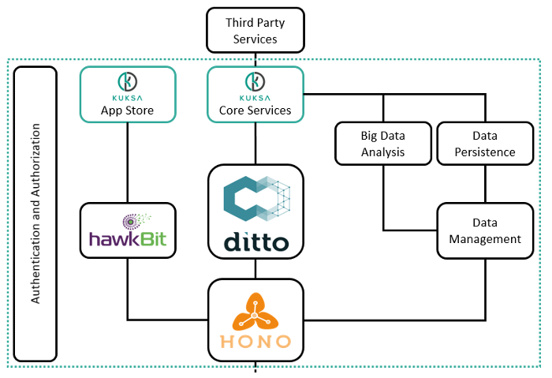

> # Cloud back-end

The cloud back-end is the counterpart to the services provided by the in-vehicle platform. It offers basic services regarding connectivity, authentication, authorization, device update and data management. These services are realized by open source [Eclipse IoT](https://iot.eclipse.org/) technologies, which are tailored to the requirements of a connected vehicle platform. An abstract overview of the cloud components is given in the Figure below.

Central functionalities rely on a unified and secure communication between the back-end and the in-vehicle platform. In this regard, the connectivity for a large number of vehicles is realized using [Eclipse Hono](https://www.eclipse.org/hono/), which receives telemetry as well as event data and allows to transmit information to the vehicles. Open communication protocols such as AMQP and MQTT are accompanied by vehicle identity management.

The large amount of collected data can either be processed by big data analysis applications via streaming or persisted using database management systems. In addition, the state on the individual vehicles is managed using [Eclipse Ditto](https://www.eclipse.org/ditto/), a digital twin implementation, which allows the synchronization of their physical and virtual representations.

A device management component takes care of provisioning software updates to the vehicle, both in terms of the core system as well as adding or modifying vehicle functionality through apps. The former comprises so-called rollout management, which controls the distribution of the software to a large number of vehicles. This component is represented by [Eclipse hawkBit](https://www.eclipse.org/hawkbit/). Applications augmenting the functionality of the vehicles are provisioned by the vehicle manufacturers or external developers via an app store.

A set of core services provide the access to the vehicles managed within the cloud back-end. In this regard, an authentication and authorization component ensures that malicious access by third-party services is prohibited. This involves all major components of the back-end infrastructure.