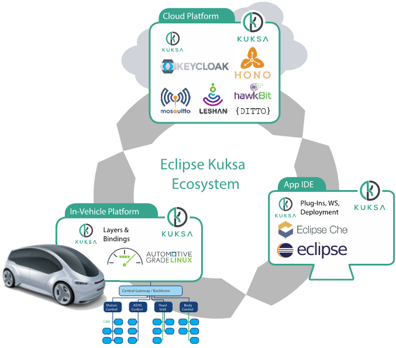
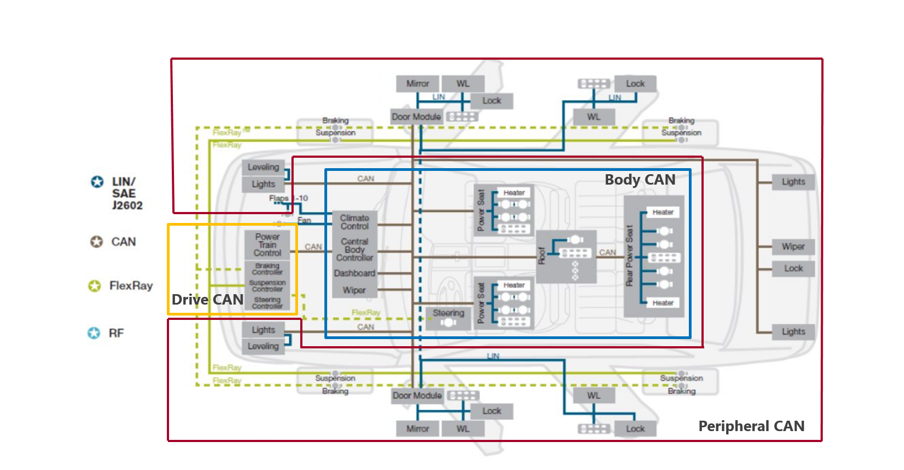
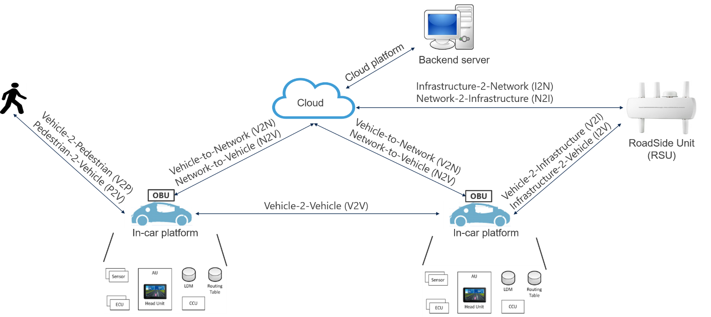
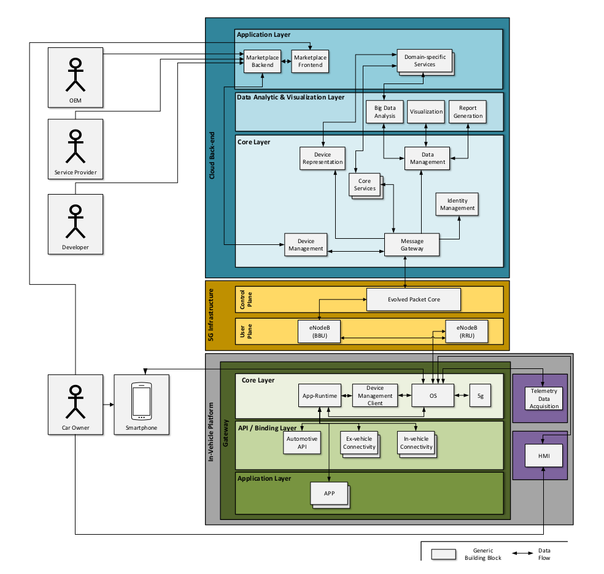

># **2. Eclipse Kuksa Ecosystem**

## 2.1 Eclipse Kuksa
|Kuksa IDE|
|---------|
|Based on Eclipse Che
|Allows Cloud and In-Vehicle Application development
|Platform independent
|Shared workspaces
|Almost configuration free
|Docker-based: VPN planned to allow remote / network independent cross compilation|

*Figure 1. Eclipse Kuksa Ecosystem.*

*(source:https://www.researchgate.net/profile/Marco_Wagner2/publication/330281127_Innovation_through_Openness_-_The_Open_Source_Connected_Vehicle_Framework_Eclipse_Kuksa/links/5c371b5892851c22a3691df8/Innovation-through-Openness-The-Open-Source-Connected-Vehicle-Framework-Eclipse-Kuksa.pdf?origin=publication_detail)*

> # **3. APPSTACLE environment architecture**

The overall platform of the security-relevant aspects of the APPSTACLE environment architecture is divided in to three building blocks:
   > 1. In-vehicle platform,
   > 2. 5G Infrastructure, and
   > 3. Cloud back-end. 
   
The above mentioned building blocks comprises a set of components which communicates between components of the same building block and/or components of different blocks.

> # **3. 1. In-Vehicle Platform**

The APPSTACLE environment is created to provide addon services to the connected vehicles. This provides a complite functionality of the vehicles through deploying the *Apps* on the in-vehicle platform. Therefore, three layers of components are required to enable this purpose:

**3.1.1.1 Core Layer**: Contains the in-vehicle platform components, such as operating system and application runtime. It, furthermore, allows the vehicle owner to interact with the vehicle, e.g., via smartphone access. In addition, it provides an intrface to the 5G infrastructure similar to the core layer of the cloud back-end. 

**3.1.1.2 API / Binding Layer**: consists of relevant APIs and components for internal and external communication.

**3.1.1.3 Application Layer**: It represents the arrangement of all Apps that are running within the in-vehicle platform. Some of the Eclipse base Open source solutions to inreach kuksa components are: 
*  Automotive Grade Linux (AGL)  
*  Eclipse hawkBit
*  Eclipse Hono
*  Eclipse Ditto
*  Eclipse Che
*  Keycloak
*  ...

*Figure 2. Eclipse base Open source solutions to inreach kuksa components*

*(source:https://www.researchgate.net/profile/Marco_Wagner2/publication/330281127_Innovation_through_Openness_-_The_Open_Source_Connected_Vehicle_Framework_Eclipse_Kuksa/links/5c371b5892851c22a3691df8/Innovation-through-Openness-The-Open-Source-Connected-Vehicle-Framework-Eclipse-Kuksa.pdf?origin=publication_detail)*

 

The in-vehicle platform addtionally provides means for rertrieving telemetry data collected by the vehicle itself as well as a human machine interface (HMI ) for user interaction.

## 3.1.2 In-vehicle connectivity :

This section provides an overview of the communication protocols that are currently used in the existing automotive architectures as well as their interconnections in the Electrical / Electronic (E/E) in-vehicle architecture.
The scope of these protocols defines the in-vehicle communication interfaces for
the APPSTACLE platform. 

## 3.1.2.1 Protocols

Automotive protocols are classified by the Society of Automotive Engineers (SAE) into four categories according to the transmission rate and their role in the automotive architecture. Specifically, Class A defines the protocols that are used for convenience systems (e.g. lighting, windows, seatcontrols) and require inexpensive, low-speed communication. Class B defines the protocols supporting instrument cluster or vehicle speed communication and require medium-speed communication. Furthermore, Class C is defined for real-time control ECUs such as the engine, braking and steer-by-wire and require high-speed communication. Finally, telematics systems usually require higher communication speed for multimedia (audio / video) and navigation, and therefore SAE defined the additional Class D communications. All four protocol Class categories are illustrated in Table 1 along with the protocols that belong to each category and are used for in-vehicle communication in terms of their characteristics.

   Firugre 3. Automotive Network.

 ### *Table 1.: Characteristics of the communication protocols*

 |Bus|LIN|CAN|CAN FD|FlexRay|MOST|Automotive Ethernet|
 |---|----|----|----|----|----|----| 
 |Used in Application domains Message transmission Access control Maximum Data Rate Protocol Class | Subnets Body Soft Synchronous Polling 20 kbps A|Soft real-time Powertrain, Chassis Asynchronous CSMA/CA 1 Mbps BC| Soft real-time a a CSMA/CA 10 Mbps D|Hard real-time Chassis, Powertrain Synchronous and Asynchronous TDMA 10 Mbps D | Multimedia Multimedia and Telematics Synchronous and Asynchronous CSMA/CA 24Mbps D| Multimedia Telematics and active safety Synchronous and Asynchronous CSMA/CD 100Mbps D| 
 

 ## 3.1.2.2 Architectural Overview of In-vehicle

Modern automotive embedded systems consist of several subsystems, which are comprised of one
or several Electronic Control Units (ECUs). In turn, the ECUs are made up of a micro-controller
and a set of sensors and actuators. They are able to communicate through the transmission of
electronic or optical signals through a dedicated communication unit. The subsystems that rely on network communication in automotive systems are divided into five main categories: power train, chassis, body, HMI, and telematics (illustrated in Figure 3). Each subsystem uses a different protocol to communicate, which is selected based on the architectural requirements and the subsystem functionality. Specifically, the powertrain domain is related to the systems that participate in the longitudinal propulsion of the vehicle,including engine, transmission and all subsidiary components. This domain is supported by a dedicated subsystem called Drive CAN using the Controller Area Network (CAN) for data exchange. The chassis domain refers to the four wheels and their relative position and movement; in this domain the systems are mainly steering and braking. In this subsystem category we find two protocols that are used for high-critical communication, namely CAN and FlexRay, as well as the Local Interconnect Network (LIN) for the lower critical functionalities (e.g. door locking, window raising / lowering). According to the EAST-EEA 1 project definition the body domain includes the entities that do not belong to the vehicle dynamics (i.e., being those that support the car’s user) such as airbags, wipers, lighting, etc. Today’s cars sometimes use two CAN buses (peripheral CAN and body CAN) which interconnect the ECUs of the comfort domain. The telematics domain includes the equipment allowing information exchange between electronic systems and the driver (displays and switches). Such interactions are possible through the infotainment subsystem that is supported by the MOST protocol. Finally additional peripheral systems (e.g.,cameras) allow the in-vehicle system to monitor and extract information from its physical environment through the use of Automotive Ethernet technologies. All the aforementioned systems are able to exchange data through a central gateway (Figure 3) that is able to map (through packet encapsulation) or forward messages from one subsystem to another.

|ID| Property|
  |------|------|
  |1. | It enables communication with the infotainment unit or the ECUs internal to the vehicle |
|2.|• Telemetry data or data specified in the Cloud platform related to internal vehicle functionalities.|• Vehicle diagnostics (e.g. health monitoring).
| |• System metadata (which components are present, heartbeats etc)|
|3.|• Interacts with the in-vehicle HW for data gathering and with the ex-vehicle connectivity for data forwarding|
|4.|• One component per vehicle with different interfaces according to the employed protocols.|
|5.|• Information about the protocols used in the internal vehicle architecture
||• Depending on the chosen protocols: what components are communicating what information|
||• Development of software modules for handling data for each protocol|

## 3.1.3 Ex-vehicle connectivity concept:

The technology evolution in the automotive vehicles contributed to the demands for smarter mobility solutions. These solutions are focused on several types of V2X communication:

• Vehicle-2-Vehicle (V2V)

• Vehicle-2-Infrastructure/Infrastructure-2-Vehicle (V2I,I2V)

• Vehicle-2-Pedestrian (V2P) / Pedestrian-2-Vehicle (P2V)

• Vehicle-2-Network (V2N) / Network-2-Vehicle (N2V), 5) Infrastructure-2-Network (I2N) /
Network-2-Infrastructure (N2I).

These types along with their interactions are demonstrated in Figure 4.

*Figure 4. V2X communication types*

The units supporting V2X communication are:

• *RoadSide unit (RSU)*: It is connected to road sensors (e.g. induction loops, cameras) and
a local control center, such that it performs actions or exchanges critical information other
vehicles or servers about road or traffic management.

• *OnBoard unit (OBU)*: The on-board unit (OBU) is a radio built-in vehicle device mounted on
each vehicle that transmits vehicle data (i.e. identification and location) to a transponder. The OBU itself is a transponder, that is, a data exchange takes place automatically and only on
request of one of the participating devices. It allows Vehicle-to-Vehicle (V2V) and Vehicle-to-Infrastructure (V2I, I2V) communications with other OBUs or RSUs.

• *Backend server* : It is composed by a PKI, traffic management and roadside unit management
servers, all accessible via the RSU’s or cellular base stations.
In order to facilitate this evolution a couple of solutions were defined that are split into 3 main categories:

• *5G radio access technologies*: This technology provides wide area, broadband access. The
5G technology is currently in the process of conceptual development and standardization by
the World Radiocommunication Conference (WRC). The 5G technology is expected to have
a specific V2X aspect of the 5G technology in a practical scale after 2020. However, in this
document we are leveraging the limited standardization to illustrate conceptually its main scope
and architectural view.

• *Pre-5G radio access technologies*: Multiple cellular technologies were identified by the ETSI
3rd Generation Partnership Project (3GPP), LoRa Alliance and other organizations, such as
Narrowband IoT , Long Term Evolution for Machines (LTE-M), LoRA are considered. Even though these technologies are already used in V2P/P2V, the main challenge when adopting them in other V2X communication types are reliability and safety, which are currently not addressed in the scope of Low-Power Wide Area Networks (LPWAN). 

• *Non-cellular technologies providing wireless access*: IEEE has defined different standards for wireless communication, such as 802.11ac and 802.11p, however only 802.11p is flexible in
terms of throughput and offers higher reliability, even though its maximal throughout is more
limited than 802.11ac (from 3 to 27 Mbps raw data rate). The reason behind this is that
802.11p was designed particularly for for safety-related Vehicular Ad-hoc NETworks (VANET),
including the V2V and V2I/I2V concepts. IEEE 802.11p technology is currently fully specified
and already deployed in different locations. The following paragraphs start with a description of the scenarios supported by 802.11p communi-cation and cellular communication. This is followed by a description on both the 802.11p and 5G technologies. In the scope of this section we focus on these two technologies, because, to the best of our knowledge, they are considered as the leading candidates for V2X communication. 

|ID| Property|
  |------|------|
  |1. | It enables outward and inward communication between the vehicle and the external entity |
|2.|• No data processing as such.
||• Re-Packs the data received from bus to appropriate format for the external entity and vice versa.|
|3.|• It has the direct connection to the BUS and no direct user interaction.|
|4.|• There will be multiple instances in the minimum two cases.|
|5.|• Driver for hardware component
||• (Since Development Stage) Need manual configuration at the moment for 5G mm Radio.|

## 3.1.4 App Runtime concept:

|ID| Property|
  |------|------|
  |1. | The APP Runtime provides the environment for executing APPs and starts / stops APPs. It has to provide and control resources for the APP, enforce access control (permissions), and isolate APPs from each other. |
|2.|APPs, configuration data (permissions, options, ...), APP data|
|3.|The APP Runtime permits or denies communication between APPs, or APP and backend (depending on "the policy"). The APP Runtime obtains APPs from the marketplace. It can be configured by the OEM and/or the vehicle owner (via backend and/or an in-vehicle user interface; probably also by devices [with authorization]).|
|4.|There is one APP Runtime per in-vehicle platform. It could be part of the operating system.|
|5.|Initialisation / start up: The APP Runtime is started during the (secure) boot process. It can be configured by the OEM and the vehicle owner (details are left open in this document), e.g., to configure permissions ("the policy").|

## 3.1.5 Automotive API concept:

The Application Programming Interface (API) for vehicles are introduced and discussed in here. The automotive API's try to achieve (a) merging the potentially very complex device and network structure of a car into a single virtual device and (b) hiding the differences between manufacturers, models and makes behind a common interface. On the other hand these interfaces strongly differ in their scope (data-subset or use-case), technological approach and creators.

### 3.3.5.1 AUTOSAR

AUTomotive Open System ARchitecture (AUTOSAR) is a cooperation between car manufacturers,
OEMs and tool manufacturers and defines a software development paradigm for Electronic Control
Units (ECUs) in the automotive domain. In order to separate the development process of application software from the chosen ECU hardware platform, AUTOSAR is introducing a layer model with the three layers Application Software, Runtime Environment and Basic Software (illustrated IN Figure 5).

*Figure 4. Autosar Layers*

The top layer is formed by the application software. It is divided into software components, each of which realizes a part of the application and can consume and provide data via so-called ports. Any communication that does not take place via port connections is forbidden. A port is classified via a port interface (here referred to as interface). Two ports can only be connected to each other if both ports use compatible interfaces.
Two important communication paradigms, that are selected by interfaces, are client-server and
sender-receiver communication. For client-server communication, a server component provides
functions (C, C++) which can be called by clients. A 1:n communication is also possible (i. e. a
server can provide its functionality to several clients). In sender-receiver communication, a sender provides data that can be consumed by receiver components. Both 1:n and m:1 communication is possible here (i.e. a date can be consumed by several components or several senders provide a date for one receiver concurrently). Many-to-many communication is not provided.

The lower layer consists of the basic software and contains the hardware drivers, the operating
system and the communication stack. The communication stack handles communication from and
to other ECUs that are connected via network interfaces like CAN, LIN, Flexray, automotive Ethernet, etc.

All communication, whether between software components on the upper level or between software
components and basic software on the lower level, is realized via the runtime environment (RTE),
which forms the middle layer. The RTE specification document defines a schema for API functions (C, C++), which are usually generated by code generators of the AUTOSAR modeling tools according to the modeled communication between software components and basic software. All communication must take place via the (generated) API functions. Other communication is not permitted. Likewise, all communication interfaces must be defined at the time of development, which makes it impossible to dynamically extend the software architecture at runtime. 

|ID| Property|
  |------|------|
  |1. | The Automotive API provides an interface to in-vehicle data for APPs (and cloud ser-vices? other entities??). An (operating system) service ("Automotive API server") implements the Automotive API, for instance similar to the "Vehicle Information Service" specified by the W3C. |
|2.|Vehicle data (sensor data, diagnosis information, configuration of vehicle compo-nents, vehicle status information, ...)|
|3.|It can be used by APPs (and cloud services, etc.) to retrieve information from the vehicle, to send data to in-vehicle components, and to write (vehicle) configuration data.|
|4.|There is one Automotive API per in-vehicle platform.|
|5.|Initialisation / start up: The "Automotive API" service is started during the (secure) boot process.|

## 3.1.6 Apps concept:

|ID| Property|
  |------|------|
  |1. |(In-vehicle) APPs are programs that provide new features to the vehicle. |
|2.|App data (depends on APP / use case)|
|3.|APPs are executed and controlled by the APP Runtime and can access in-vehicle data via the Automotive API. They can communicate with other entities via con-nectivity APIs (cf. architecture picture). If permitted (by "the policy"), they might communicate with cloud services (backend providers) and other APPs, and they could interact with the driver via a GUI (if available). APPs can access resources via the APP Runtime (subject to "the policy"). A user can install APPs from the Marketplace in the vehicle.|
|4.|There can be multiple APPs per in-vehicle platform.|
|5.|Initialisation / start up: APPs are started by the APP Runtime. Configuration data depends on the APP / use case.|

## 3.1.7 Device Management Client concept:

|ID| Property|
  |------|------|
  |1. |The DM is responsible for keeping the devices compliant to the whole system land-scape. This starts with building up a base in communication and process protocols. It is also providing features for securely enrolling new devices, governing and con-figuring them while being out in the field, monitoring and debugging their behavior remotely and maintaining the devices with software updates. Four subjects can be distinguished:
||• Enrollment includes provisioning and authentication for bringing new devices into an IoT landscape. The authentication assures that only trust-worthy devices are added to the network and connected to cloud services. Also only authorized users should be able to bring in new devices and gain access according to their roles granted.
||• Governing contains features for controlling and configuring devices. As IT systems are often under a constant development, some parts change and so do some of their constants, for example network addresses or ports.
||• Monitoring keeps an eye on all components of the system and their status. Reports and alerts for incidents are raised and logged. An on-time awareness of system issues is enabled. For diagnosis and solving software bugs it is also imperative to load log dumps remotely from devices.
||• Maintenance with the ability to distribute and apply software updates is the fourth subject. The device management assures that the update is delivered and applied to the device according to the present constraints. Feedback mechanisms answer back to the cloud for a detailed status of the update. 
|
|2.|**Process**
||• System states
||• Application states
||• Update states
||• Management Calls
||• Push Calls
||• Alarms
||• Enrollment policies
||• Updates, Update scheduling
||• Inventory Hardware/Software listings
||• Communication requests
||**Provide**
||• Access to resources through OMA-DM Management Objects (http://www.openmobilealliance.org/wp/OMNA/LwM2M/LwM2MRegistry.html)
|| – Management access through LwM2M)
||• Push Service (for notifying in-vehicle Applications form the cloud)
||• Monitoring Service
||• Update Service (Maintanance)
||• Keep-Alive Signal Service
||• Inventory Hardware/Software
||• Enrollment Service
||• Control Service (e.g. shutdown certain components)|
|3.|• Apps, OS: (Re-)Configure, Update
||• ECU: Flashing/Updating ECUs
||• Apps: Notify/Wake Up through push
||• HW/SW: Read Inventory
||• HW/SW: access on resource (if Management Object is defined)
||• User: Update scheduling|
|4.|The DM can only exist once per vehicle. But it is split into its functional groups (subjects). A hierarchical design of distributed DMs in a vehicle might be the subject of another design.|
|5.|• Authentication Set (MAC, UUID, Public Key)
||• Cloud contact
||– Address of DM at the desired cloud
||– Certificate|

## 3.1.8 Operating System (OS) concept:

|ID| Property|
  |------|------|
  |1. |The Operating System is the backbone any platform where it operates including In-vehicle platform. We also consider drivers as being part of the Operating system.
||*Operating System*
||• consists of kernel and user space components
||• provides security
||• I/O and networking services to applications running in user space
||• runs on bare metal or hypervisor
||• OS kernel provides:
||– processes/thread management including scheduling
||– inter process communication
||– memory management
||– access to underlying HW
||– networking stacks
||– I/O stacks
||– security subsystem include:
||∗ access control (e.g. MAC)
||∗ crypto and key management
||∗ integrity measurement
||∗ entropy pools and gatherig entropy from variouos sources It is also important to highlight that the security hardening of an OS scrucial to the platform and application security |
|2.|**Process**
||• data to/from underlying HW
||• data to/from networking
||• data to/from file system
||• user input
||• data exchanged between kernel and user space
||• data exchanged between processes
||• configuration data such as security policies, system settings,..
||**Provide**
||• System state information (running processes, CPU utilization, etc.)
||• log data
||• debug or diagnostics data if certain debug features are enabled|
|3.|• *Access to underlying HW*
||– peripherals
||– networking interfaces
||– any physical interface
||– HW based crypto and key management functionality
||– HW based TRNG (True Random Number Generator)
||• *App-Runtime (transport layer)*
||– Provide transport layer interface for Apps (inter-app communication, app to cloud backend communication)
||– Provide system level services (file access, etc.)
||• *Device Management Client (transport layer)*
||– Provide transport layer interface for communication with device management (cloud backend)
||• *5g Infrastructure (data link layer)*
||– Connection Management
||• *Smartphone (data link layer)*
||– Pairing
||– Connection Management
||– Data Transfer
||• *Net-IDS*
||– Provides Interface to allow the Net-IDS to monitor network traffic.|
|4.|Different subsystems on a vehicle may be running their own OSes
||• whether on bare metal or virtualized
||• whether micro kernel based, unikernel based or rich OS such as Linux|
|5.|• build and runtime OS configuration
||– for process, resource management, memory management, functionality, security,..
||– policies (e.g. security)
||– configuration of different processes
||– networking configuration
||• User credentials|

> # **3.2. The 5G-Infrastructure**

The 5G infrastructure enables the communication between the connected vehicles and the cloud back-end. Based on the 5G standard discription, two component layers are structured as *control plane* and *user plane* which represents communication with cloud back-end and communication with the connected vehicle respectively.

5G is the next generation of mobile communication technology. It is expected to be defined by theend of this decade and to be widely deployed in the early years of the next decade. As opposed to earlier 3G and 4G technologies, 3GPP conceptualized 5G to be more than another mobile broadband connectivity, covering a variety of use-cases and industries.
5G was initially based on the conceptual composition as well as evolution of cellular technologies. This is because the different technologies have communication requirements, that are focused in a local (LAN) or wide area network (WAN) communication.

In particular, IEEE’s 802.11p has been developed to support different types of wireless communications (e.g. PAN, LAN), but since it is based on CSMA/CA its performance degrades quickly as network load increases. This happens because a high number of transmitting stations will increase the number of collisions on the communication medium. Additionally, since it is was designed for short-range transmissions (transmission range up to 1km), many vendors introduce a multi-hop functionality to increase the transmission range. An example of multi-hop functionality is introduced in the European Cooperative Intelligent Transport System (C-ITS) protocol stack named as GeoNetworking. Furthermore, another technology that could not support as standalone broadband (e.g. WAN) communications is LTE. The main drawback of this technology is that every transmitted packet must traverse the infrastructure, meaning that each infrastructure failure will have a strong impact on connectivity of the entire network. Furthermore, even though broadband connections can be supported in LTE, scenarios where the infrastructure is not available due to outof-coverage are also quite probable. Finally, since LTE was designed to use radio resources in order to allow broadband communication, its extension in V2X connectivity where smaller data packets and higher bandwidth are required is suboptimal in terms of consumed resources still remains a great
challenge.

## 3.2.1 Evolved Packet Core (EPC) concept:

|ID| Property|
  |------|------|
  |1. |EPC includes a number of components such as MME (Mobility Management Entity), SGW (Serving Gateway), PGW (Packet Data Network Gateway), HSS (HomeSubscriber Server). Each of these components have their own purpose
||• MME (Mobility Management Entity): located in the control plane and handles authentication, roaming and other management functions
||• SGW (Serving Gateway): handles routing user data packets
||• PGW (Packet Data Network Gateway): handles data connectivity with external networks. This is also where packet processing and lawful interception can take place
||• HSS (Home Subscriber Server): handles user subscription information |
|2.|• MME (Mobility Management Entity): authentication data, roaming data
||• SGW (Serving Gateway): processes user data packets
||• PGW (Packet Data Network Gateway): policy enforcement, packet processing and filtering.
||• HSS (Home Subscriber Server): processes and stores user ubscription data|
|3.|• MME interacts with eNodeB, SGW and HSS
||• SGW interacts with MME and PGW
||• PGW interacts with SGW and external network
||• HSS interacts with MME|
|4.|There can be multiple instances|
|5.|Depends on the vendors and the products|

## 3.2.1.1 eNodeB (Baseband Unit) (BBU) concept:

ID| Property|
  |------|------|
  |1. |BBU (Baseband Unit) is responsible for processing baseband signals received from RRUs and further communicating data with EPC.|
|2.|Processes baseband signals received from RRUs (Remote Radio Units) and other data from EPC|
|3.|Interacts with RRUs and EPC|
|4.|There can be multiple instances|
|5.|Depends on the vendors and the products|

## 3.2.1.2 eNodeB (Remote Radio Units) (RRU) concept:

ID| Property|
  |------|------|
  |1. |Interacts with user equipment by using a signaling protocol and relays baseband signals to BBUs for further processing|
|2.|Signaling data|
|3.|Interacts with user equipment and BBUs|
|4.|Multiple instances|
|5.|Depends on the vendors and the products|

> # **3.3. Cloud back-end**

The cloud back-end provides service components to the connected vehicle by making sure a reliable and safe functionality according to the pre-defiened operation. Just like the In-vehicle platform, the cloud back-end is composed of multiple layers: 

**Core Layer**: the core layer fuctions as
* central back-end applciations
* messaging infrastructure
* control the message flow from and to the connected vehicles, and
* device update management and data management. 
  
**Data Analytic & Visualization Layer**: this layer analyzis and visualizes the data transmitted by the vehicle based on the functionalities of the core layer.

**Application Layer**: In general, applications that are deployed on in-vehicle platforms require a cloud back-end counterpart. Often, applications in the back-end are provided by third parties allowing vehicle owners to aquire certain functionalities. The market place is also accessible for developers and serivce providers to register and upload applications. The original equipment manufacturers (OEM s) has the access and controls on contents of the market place.

## 3.3.1 Message Gateway concept:

ID| Property|
  |------|------|
  |1. |• Serves as central messaging hub
||• Provides a set of micro services that transport messages from the car to the other components within the APPSTACLE backend and vice versa
||• Implements routing and brokering mechanisms|
|2.|**Input and Output**
||• Telemetry data
||• Event messages
||• Command & control messages
||• Software updates
||• Each message type may have a different quality of service level, depending on the configuration of the system
||**Messaging Protocols**
||• *MQTT*
||– Publish/subscribe model
||– Implements own security model
||• *HTTP (REST-based)*
||– GET, SET, PUT, DELETE
||• *Other protocols*|
|3.|• Receiving and routing messages to the correct recipient
||• Providing or leveraging identity management for connected devices|
|4.|• There exists only a single instance within the cloud backend|
|5.|• Deployment configuration regarding micro services:
||– External IP addresses
||– Ports
||– Connection to other services, e.g, identity management, service bus, etc.|

## 3.3.2 Device Management Backend concept:

ID| Property|
  |------|------|
  |1. |• Managing the software stack on the individual devices
||• Responsible for distributing the sotware artifacts to the devices
||• Steering software rollout campaigns for large sets of devices|
|2.|• It provides arbitrary software and data artifacts that are stored in one or multiple repositories|
|3.|**Input**
||• It interacts either with an app store or a backend service that is provided by the OEM
||• It receives commands that initiate the change of software stack of one or multiple devices 
||**Output**
||• It sends software and data artifacts to one or multiple devices
||• The outbound communication is ideally conducted via the messaging gateway, managing the packaging according to the according protocol
||– HTTP
||– LWM2M
||– OMA-DM
||– Other
||• The outbound communication may also be realised using direct communication to the devices|
|4.|• There exists only a single service within the cloud backend
||• The may exist multiple instances behind the service interface|
|5.|• The configuration for initialization is provided within deployment scripts
||• The device management resources are expected to be deployed into an existing cluster|

## 3.3.3 Report Generation concept:

ID| Property|
  |------|------|
  |1. |Report Generation is a component to generate business reports from the data collected by the cloud platform.|
|2.|data collected by the cloud platform and, in particular, results from data analytics; output is a "report" (document)|
|3.|The Report Generation component takes data from the Data Management (e.g.,results of the data analytics component) and creates reports, including visualizations,lists, documents, charts, etc.
||It is implemented based on Eclipse BIRT.
||Q: How is report generation triggered - periodically? by Apps? what interfaces exist?
||Q: Who can request request reports? End-users (e.g., vehicle owner)? Service providers? OEMs?
||Remark: It must be ensured that report generation cannot be misused by malicious users to violate data protection rules or to obtain confidential information without authorization.|
|4.|Usually there is one logical report generation component per cloud instance, but potentially, there could be different report generation components for different kinds of reports.|
|5.|• The configuration for initialization is provided within deployment scripts
||• The device management resources are expected to be deployed into an existing cluster|

## 3.3.4 Marketplace Backend concept:

ID| Property|
  |------|------|
  |1. |• Stores and manages the software and data artifacts related to the apps that are installed on the in-vehicle platform
||• Initiates and controls the communication with the app provider backends
||• Interacts with potential payment providers, depending on the payment methods applied (Credit/Debit Card, SMS)
||• Stores the data related to registered users (vehicle owners and app developers)
||• Central hub for the interaction with app developers
||• Provides app data to the in-vehicle platforms via the device management back-end
||• Scan app software and data artifacts regarding vulnarabilities and malware
||• Question: Should in-app transactions be possible?|
|2.|**Process**
||• User input via the Marketplace Frontend
||– Vehicle owner core data (Name, Address, Supported payment methods, User vehicle mappings (1 User, N Vehicles))
||– App developer core data (Name, Company, Address, Supported payment methods, Apps provided)
||– Transactional data regarding buying and returning apps (Transaction ID, Transaction status, Payment method applied, Vehicle Identification Number, Version of the app transferred
||**Provide**
||• Software and data artifacts that are provided by the app developers
||– Software (Compiled source code)
||– Data (Licenses, Documentation, Version history, Supported in-vehicle software platforms, Supported in-vehicle hardware platforms)
||– API/Frontend for app developer interaction (Transferring software and data artifacts to the backend, Receiving account and app related information, e.g. number of downloads or total revenue per app)|
|3.|**Input**
||• Marketplace frontend (see informations listed above)
||• Payment provider backends (Handling of payment transactions)
||• App developer backends (Receiving data and software artifacts) Output
||• Marketplace frontend (Deliver data requested by the frontend, e.g., results for search queries)
||• In-vehicle platforms, via Device Management component (Software and dataartifcats regarding specific apps)
||• App developer backends (Transaction and evaluation data)
||• Identity Management (Requests for user authentication and authorisation)|
|4.|• There should be only a single instance within the cloud backend |
|5.|• Deployment configuration regarding micro services
||– External IP addresses
||– Ports
||– Connection to other services, e.g, Identity Management|

## 3.3.5 Visualization concept:

ID| Property|
  |------|------|
  |1. |The Visualization component creates graphical representations of time series data retrieved via the Data Management component. For example, the Visualization component can generate graph like representations of the evolution of telemetry data over time.|
|2.|**Process**
||• Time series data (e.g., telemetry data, performance/monitoring data) 
||**Provide**
||• Graphical representations that can be utilized for report generation|
|3.|• Data mangement component
||– retrieving time series data
||– sending representation for storage and use in report generation|
|4.|There should be at least one Visualization instance per Data Management instance because of scalability aspects. Multiple instances per data management instance are possible. **Not sure here**|
|5.|• Data source
||• Dashboard information
||– Metrics
||– Representation style
||– Layout information|

## 3.3.6 Marketplace Frontend concept:

ID| Property|
  |------|------|
  |1. |• Provides visual interface that enable the interaction with the Marketplace Backend
||• Vehicle owners can search and order apps as well as initiate their transfer to the in-vehicle platform
||• Allows app developers to access app storage and monitoring data
||• Allows vechicle owners and app developers to edit their core data / profiles|
|2.|**Process**
||• Core data (vehicle owner and app developer) entered via the visual interface
||• Query database regarding apps available for the specific in-vehicle platform
||• Software and data artifacts send by the app developers
||• Data referring to payment transaction, e.g., data exchange with payment providers 
||**Provide**
||• Visual interface depicts information regarding
||– Vehicle owner and app developer core data
||– App transactions
||– App search query results|
|3.|**Input**
||• Vehicle owner
||– Enter and update core data
||– Fill out order forms
||– Search apps via query masks
||• App developer
||– Enter and update core data
||– Upload apps
||– Retrieve monitoring data
||**Output**
||• Vehicle owner
||– Display core data
||– Display app search queries
||• App developer
||– Display core data
||– Display monitoring data|
|4.|• There exists only a single services within the backend
||• There might be several container instances behind this service|
|5.|• Deployment configuration regarding micro services
||– External IP addresses
||– Ports
||– Connection to other services, e.g, Marketplace Backend|

## 3.3.7 Data Management concept:

ID| Property|
  |------|------|
  |1. |• Manages the data that is transferred from the in-vehicle platforms to the cloud backend
||**Historical Data**
||• Provides storage mechanisms to persist historical sensor data
||• Is indepedent of the storage technoligies applied
||– Time series vs. transactional vs. analytical data bases
||– Relational vs. object data bases 
||**Streaming Data**
||• It assumed that only portions of the data transferred can actually be stored, due to the large volume
||• Instead of storing the full set of data, it may be analysed on-the-fly
||• Therefore data must be rerouted to corresponding systems|
|2.|• Sensor data that is collected by the in-vehicle platform and transmitted by the message gateway|
|3.|**Input**
||• Message Gateway
||– Sends sensor data to the Data Management component
||– Data Management component acts as a consumer
||**Output**
||• Data bases
||– Receive subset of data that is transferred via the Message Gateway
||• Stream processing engines
||– Receive full set of data that is transferred via the Message Gateway|
|4.|• There exists of a single vertically scaled instance within the cloud backend
||• It may be connected to multiple data bases and stream processing engines|
|5.|• Deployment configuration regarding micro services
||– External IP addresses
||– Ports
||– Connection to other services, e.g, Message Gateway and Big Data Analysis|

## 3.3.8 Identity Management concept:

ID| Property|
  |------|------|
  |1. |• Managing the identities of the entities within the connected car environment, such as:
||– Vehicles
||– Backend services within the following layers:
||∗ Core Layer
||∗ Data Analytic & Visualization Layer
||∗ Application Layer
||– Marketplace users
||• Authorization of vehicle access by marketplace users|
|2.|• Login data of the marketplace users
||• Authentication data of backend services as well as vehices
||• Authorization data of vehicles, backend services and marketplace users|
|3.|• Exchange of login data, authorization data and authentication data|
|4.|• There exists only a single instance within the cloud environment.|
|5.|• The setup of the identity management component requires the awareness regarding the individual backend services.
||• Regarding the authentication and authorization of vehicles and marketplace users, specific mechanisms have to be selected and configured.|

## 3.3.9 Device Representation concept:

ID| Property|
  |------|------|
|1. |• Providing an abstraction between the physical devices, the vehicles, and their digital representations (digital twin)
||• Managing the state of the vehicles attached to the backend infrastructure   (reported vs. desired vs. current)
||• Providing a unified interface for accessing the information provided by the vehicles
||• Organizing the digital twins for all vehicles attached to the backend infrastructure|
|2.|• Information provided by the physical devices, in particular sensor data|
|3.|• Synchronizing data between the physical devices and their digital representations
||• Processing data provided by the physical devices|
|4.|• There exists only a single instance managing all digital twins referring to all cars within the connected car environment|
|5.|• The Device Representation component has to be connected to the message gateway
||• A digital twin is created for each connected vehicle added to the environment|

## 3.3.10 Big Data Analysis concept:

ID| Property|
  |------|------|
|1. |• Vehicles provide large amounts of data that are is by the Data Management component.
||• Big data analysis provides insights, e.g., the properties and usage of individual vehicles as well as their interaction.|
|2.|• It consumes data collected by the vehicles that is persisted by the Data Management component.
||• This data serves as input for the analytical tasks, depending on the individual objectives.
||• The analytical results are provided to Domain-specific services.|
|3.|• Data is retrieved from the Data Management component.
||• Analytical tasks are initiated by Domain-specific Services.|
|4.|• There may be multiple Big Data Analysis components within the environment.|
|5.|• The Big Data Analysis component(s) have to be connected to the Data Management component as well as the Domain-specific Services.
||• This includes deployment configuration data, such as:
||– External IP addresses
||– Ports|

## 3.3.11 Core Services concept:

ID| Property|
  |------|------|
|1. |• Provide an abstraction layer regarding the access of the connected vehicles within in the environment.
||• The focus is especially on the sending messages to and receiving messages from the connected vehicles.
||• Therefore, it relies on the functionality provided by the Message Gateway component.
||• Potentially restrict the access of Domain-specific Services.|
|2.|• It provides access to the information provided by the connected vehicles to the Domain-specific Services.
||• It allows to send messages from Domain-specific Services to the connected vehicles.|
|3.|• Consume data from the Message Gateway component and route it to the Domain-specific Services.
||• Consume messages from the Domain-specific Services and route them to the Message Gateway component.|
|4.|• There exist different services but for each service a single instance.|
|5.|• The Core Services have to be connected to the Message Gateway component as well as the Domain-specific services.
||• This includes deployment configuration data, such as:
||– External IP addresses
||– Ports|

## 3.3.12 Domain-specific Services concept:

ID| Property|
  |------|------|
|1. |• The Domain-specific Services provide added value to the users of the APPSTACLE connected car environment.
||• The provide selected functionalities that leverage the data as well as the communication provided by the connected vehicles.|
|2.|• It consumes data that is provided the Core Services component.
||• It accesses and synchronizes the state of the connected vehicles via the Device Representation component.
||• It consumes aggregated data that is provided by the Big Data Analysis component.|
|3.|• Accessing and consuming data that is provided by the components attached.
||• Sending messages to the connected vehicles.|
|4.|• Domain-specific Services may be provided by third-party developers.
||• Therefore, there may exist a set of individual services which do not necessarily depend on each other.|
|5.|• Depending on the use case, the individual services have to be connected to the Device Representation component, the Big Data Analysis component as well as the Core Services component.
||• This configuration data includes:
||– External IP addresses
||– Ports|

           
*Figure 5. The above picture summurizes the the architectural concepts discussed so far.*