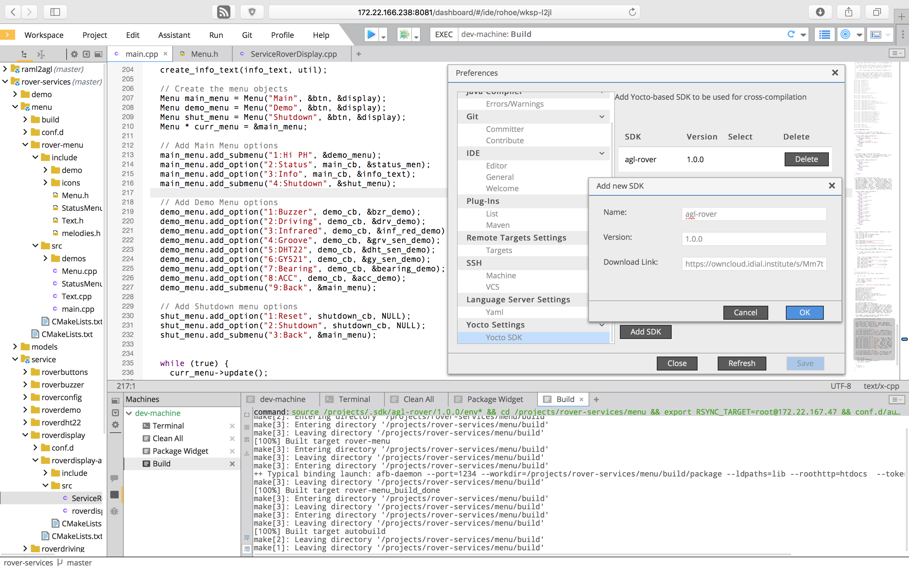

># **7. Kuksa App IDE**

### *Table 6.1 Eclipse Che Kuksa instance version*
   |Available|Version number|
   |---------|--------------|
   |Current  |6.10|
   |Plan     |7.0|

## 7.1 Getting Started with the App IDE

Kuksa IDE is built as a full custom Eclipse Che Assembly. Therefore, it includes all assembly components specified and described in Eclipse Che Assembly are included into Kuksa IDE’s build system. A quick start steps can be found from the link [here](https://kuksa-che-ide.readthedocs.io/en/latest/quick/index.html).

## 7.1.1 Requirement system configuration

The neccessary prerequisite to build and deploy Eclipse Che Kuksa are:
    
    -  A running docker instance on a Linux host system (tested with Ubuntu 18.04).
  
    -   Maven
  
Additionally, steps for building and running a Eclipse Che Kuksa instance in version 6.x are available [here](https://kuksa-che-ide.readthedocs.io/en/latest/).

## 7.1.2 How to setup the IDE

To set up Eclipse Che Kuksa, the following steps are necessary. If one wants to build and deploy AGL applications & services within Che:

- Create a new workspace with Automotive Grade Linux (AGL) as selected stack
- Go to "Profile" → "Preferences" → "Remote Targets" and add a new Remote Target with the device IP and the according User, e.g. "root". Then select the Target.
- Go to Profile → Preferences → Yocto Settings and add a new SDK with a Name, e.g. "agl-rover", a Version, e.g. "1.0.0" and a link to an appropriate AGL SDK, e.g. the AGL [Rover](https://github.com/app4mc-rover) SDK from "https://owncloud.idial.institute/s/kpntqpTz8cgx7X6/download", as Download Link. Then select the added Yocto SDK.
To avoid connection trouble, open the Terminal and ssh into the appropriate Device: ssh < User >@< IP >

## 7.1.2.1 Model-driven Development of AGL Applications and Services

The Eclipse Che Kuksa instance simplifies the development of AGL applications and services. AGL features the usage of automotive applications based on HTML5, JavaScript, and C/C++, which run on top of AGL. While applications realize a distinct use case, services offers functionality to all applications. For more information please refer to the [AGL documentation](https://docs.automotivelinux.org/docs/apis_services/en/dev/).

The following sections demonstrate the development of AGL applications/services in a model-driven way based on the tool RAML2AGL (cf. Section [Raml2AGL](https://github.com/eclipse/kuksa.ide/tree/master/che-6#raml2agl) ) as well as the building and deployment of AGL applications/services to a remote device running AGL (cf. Section [Building & Deploying](https://github.com/eclipse/kuksa.ide/blob/master/che-6/building-and-deploying)).

## 7.1.2.2 IDE

The IDE provided under Eclipse Kuksa not only support the development of applications for the vehicle component, but also the creation of applications for the cloud. Users should be able to choose between two different workspaces and technology stacks that contain the preconfigured and embedded APIs as well as software libraries of the respective applications to be developed. This allows the car to be equipped with new functions and new services to be deployed in the cloud.

Kuksa offers various APIs for implementing vehicle applications, a project template for cloud services, and wizards for easily providing vehicle applications in the App Store via the IDE. The extensive provision of the various APIs and libraries in the IDE enables accessing existing communication interfaces for the secure data transmission, storage, management, and authentication without having to take separate measurements for processing or interpreting the data.

Kuksa also supports the simplified deployment of new applications for both the cloud and vehicle components. This is provided by a pre-configured Eclipse Che stack, to which only the address of a target platform must be specified. Configuration, building and deployment can be done at the push of a button without further configuration or processing. Depending on the application, different development tools (e.g. Logging, Debugging, Tracing,...) can be included. Of course, syntax highlighting, code completion, and other necessary IDE functions are supported. For instance, the in-vehicle Eclipse Kuksa Che stack for AGL development activities features including Yocto based SDKs in order to support target specific programming shown in the screenshot below. After compiling and building software, specifying a target IP allows also the deployment process.

In order to make new applications applicable to a greater amount of vehicles, applications need to be centrally checked, managed, and organized with regard to various in-vehicle derivatives and variants in such a way that only vehicle-appropriate applications are accessible. Similar to a Smartphone App Store, it has to be possible to add new functions and applications to their vehicle or perform updates or upgrades. Therefore, standardized interfaces of the in-vehicle and cloud platforms are required and they must offer the most diverse and yet simple infrastructure for vehicle owners. Authentication methods, security concepts, variant management, and suitable data transmission technologies in combination with the publicly accessible ecosystem form mandatory components as well as the difference to existing solutions. [Click](https://www.eclipse.org/community/eclipse_newsletter/2018/july/kuksa.php) here to read more.

## 7.1.3 Writing your first Kuksa In-Vehicle App

Kuksa Demo-Apps for the In-Vehicle platform can be found from the repository link [here](https://github.com/eclipse/kuksa.apps/tree/master/invehicle-apps).

## 7.1.4 Writing your first Kuksa Cloud App

Demo Kuksa Cloude App can be found from the repository link [here](https://github.com/eclipse/kuksa.apps/tree/master/cloud-apps). However, by the time of preparing this document, the repository content was void.

##  *7.1.5 Testing your Apps* 

##  *7.1.6 Deploying your Apps* 

##  *7.1.7 Install your In-Vehicle App in your car (see In-Vehicle platform Getting Started)* 

##  *7.1.8 Install your Cloud App in your Cloud (see Cloud platform Getting Started)* 

 
## 7.2 Some Kuksa App examples
 

The eclipse Che doesn’t provide a standard mechanism to add custom sample projects during build time. Therefore, Kuksa IDE provides an easy and straight forward mechanism to append them to ones provided by Eclipse Che during build time. [Sample Projects](https://gitlab-pages.idial.institute/pedro.cuadrachamorro/kuksa-ide/samples/index.html) can be found from this link.
