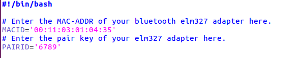

[Eclipse Kuksa](https://www.eclipse.org/kuksa/) includes an open and secure cloud platform that interconnects a wide range of vehicles to the cloud via open in-car and Internet connection and is supported by an integrated open source software development ecosystem. The Eclipse Kuksa project conatins a set of repositories and this repo is one among those that contains in-vehicle platform code and also contains required layers and bindings to build a Kuksa adapted AGL (Automotive Grade Linux) distribution. The in-vehicle platform is primarily designed to work with AGL. However the individual components found in [this repo](https://github.com/eclipse/kuksa.invehicle) could be used on other platforms as well.

Kuksa is a wrapper project around Automotive Grade Linux (AGL). From its side, AGL uses Yocto/Bitbake building system to build an automotive domain specific Linux distribution. Therefore, this projects provides a building system that adds Kuksa's specific Bitbake layers on top of the original AGL. The scripts in this project help ease the process of building an AGL image by simple using a few commands. This project includes the yocto recipes found in meta-kuksa project.

Therefore, to get started with In-Vehicle platform, AGL KUKSA Build and Run on Raspberry Pi 3 / Compute Module 3 (Lite) can be found from the link [here](https://github.com/eclipse/kuksa.invehicle/tree/master/agl-kuksa).

In order to Build the Image/SDK with cmake scripts, the required system configuration both (hardware and software) are:

    Need Ubuntu 16

    Fast Internet connection.

    Minimum of 100 GB memory.

    Some patience as it takes about 8 hours the first time.

To build the Image/SDK, run;

  cd <agl-kuksa-root>
  mkdir build
  cd build
  cmake ..
  make <agl-kuksa-target>

Where <agl-kuksa-target> can be;

    agl-kuksa-sdk: AGL kuksa image and SDK
    agl-kuksa: AGL kuksa Image only
    Other Targets to follow.

The output images can be seen at <agl-kuksa-root>/build/images and the SDKs at <agl-kuksa-root>/build/sdk.

To set up and build the Image using yocto/bitbake, the neccessary prerequisites are: 

    Need Ubuntu 16

    Fast Internet connection.

    Minimum of 100 GB memory.

    Some patience as it takes about 8 hours the first time.

## Steps

## *Setup the machine*

Execute

sudo apt-get install gawk wget git-core diffstat unzip texinfo gcc-multilib build-essential chrpath socat libsdl1.2-dev xterm cpio curl

This will install the necessary packages.

Execute

export AGL_TOP=$HOME/workspace_agl; mkdir -p $AGL_TOP

Execute

mkdir -p ~/bin ; export PATH=~/bin:$PATH ;curl https://storage.googleapis.com/git-repo-downloads/repo > ~/bin/repo; chmod a+x ~/bin/repo

This will set up the repo tool. Repo tool is used to download the recipes for AGL image.

Execute

cd $AGL_TOP ;repo init -b flounder -m flounder_6.0.1.xml -u https://gerrit.automotivelinux.org/gerrit/AGL/AGL-repo ;repo sync

This will download the Funky Flounder version of AGL. This version has been tested and is recommended.

## Start Building

Execute

source meta-agl/scripts/aglsetup.sh -m raspberrypi3 agl-demo agl-netboot agl-appfw-smack ; bitbake agl-demo-platform

This will start the build system and would take about 7 hours to complete if you are running for the first time, so you could take a nap :P. The Yocto/bitbake build system has a caching mechanism and hence from the next time on, this would only take a few minutes.

## Adding Kuksa layers

Go to $HOME/workspace_agl/build/conf folder and open bblayers.conf file.

Append the following lines to the end of the file.

BBLAYERS =+ " \
    ${METADIR}/meta-kuksa \
    ${METADIR}/meta-kuksa/meta-kuksa-bsp \
    ${METADIR}/meta-virtualization \
"

Now copy the meta-kuksa folder (Link : https://github.com/eclipse/kuksa.invehicle/agl-kuksa) into the $HOME/workspace_agl directory.

## Building for the Raspberry Pi Compute Module 3 (Lite)

To build for the Raspberry Pi CM3 (Lite) platform, go to $HOME/workspace_agl/build/conf folder and open local.conf file.

Append the following lines to the end of the file.

KERNEL_IMAGETYPE = "zImage"

## Configure meta-kuksa layer

The kuksa layer contains recipes for the APIs and Apps contained in Eclipse kuksa Invehicle repo.

The AGL image with meta-kuksa layer adds w3c-visserver-api and elm327-visdatafeeder as systemd services. It will install the datalogger apps in the respective locations /usr/bin/datalogger-<PROTOCOL>
## Set up wifi

--- Ignore this step if wifi is not required ---

With meta-kuksa layer the wifi connection could be set up while building an Image so that the target device connects to the specified wifi, which make it easier to ssh into the device. The wifi settings could be configured by modifying the meta-kuksa/recipes-devtools/wifi-conf/files/wifi_default.config file. Update the "Name" and the "Passphrase" of the wifi you want the device to connect to. More more secured wifi connection please refer to the link

## configure Bluetooth connection with ELM 327 bluetooth adapter

The elm327-datafeeder service connects to an ELM327 Bluetooth adapter to retrieve data from the vehicle. Hence the bluetooth connection with the ELM327 adapter needs to be established before the service starts. The BT connection can be configured by Updating the MAC-Address of the adapter along with its pairing PIN. The MAC-Addr and PIN can be updated in file meta-kuksa/recipes-elm327-visdatafeeder/elm327-visdatafeeder/files/bt_setup.sh

Update the fields

Alt text

Now Execute the below line to build image with Kuksa layers

source meta-agl/scripts/aglsetup.sh -m raspberrypi3 agl-demo agl-netboot agl-appfw-smack ; bitbake agl-demo-platform

This would take a few minutes to execute and at the end of the process the bootable image for RaspberryPi 3 will be found in the below location

$HOME/workspace_agl/build/tmp/deploy/images/raspberrypi3