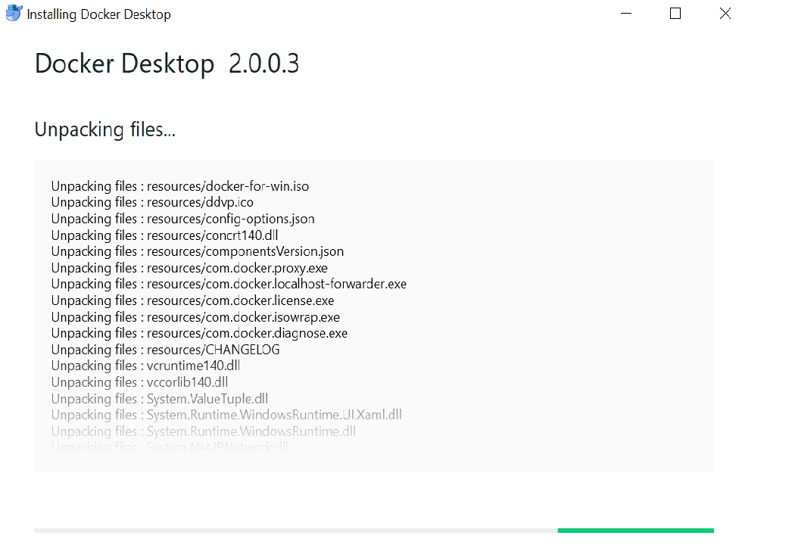

Author: Arun & Kirubel, Date: 20.03.2019,Training Material
# Getting started with the App IDE
## Introduction 
(Write the context of Kuksa - APPSATCLE Project Max 7 sent)
Kuksa IDE is an open source developer workspace and Cloud IDE. The Kuksa IDE is a full custom build based on the Eclipse Che. 
(Write about Kuksa IDE from Che components)
The development of software-intensive automotive systems by the Origional Equipment Manufuctureres (OEM) still has unresolved challanges. Therefore, development of standardized car-to-cloud senario could improve the activities and invites external applications, service providor and use of open-source software. A platform such as: the Eclipse [Kuksa](https://www.eclipse.org/kuksa/), which is based on the APPSTACLE project which itself is part of the Europian ITEA3 program provides mobility as a service as well as after-sales innovations and the means to catch up with the fastly growing of software in changing the business in connected cars. Kuksa is a secure and open automotive platform built as a full custom Eclipse Che Assembly. [Eclipse Che](https://en.wikipedia.org/wiki/Eclipse_Che) is an open-source java based integrated developer inveronment as cloude, and server which provides a mult-user remote development platform. It consists of a Software Development Kit (SDK) to allow application for certain software packages, framework, platform or computer systems by allowing to create plug-ins for those frameworks,languages or tools.
### Getting started with the App IDE
[Kuksa is divided into a series of components](https://wiki.eclipse.org/Kuksa): 

*InVehicle*, *AGL build scripts*, *IDE*, *Cloud*, *Integration*, *Apps*, *[Website](https://projects.eclipse.org/projects/iot.kuksa)*. Each of these components will be discussed in details. 
### Installing Docker for Windows Desktop
1. Double-click [Docker](https://docs.docker.com/docker-for-windows/install/) Desktop for Windows Installer.exe to run the installer. The downloaded installer (Docker Desktop Installer.exe), can be found from (download.docker.com). It usually downloads to the Downloads folder, or else, run it from the recent downloads bar at the bottom of the web browser (if Google Chrome is used).

2. Follow the install wizard to accept the license, authorize the installer, and proceed with the install. 

3. You are asked to authorize Docker.app with your system password during the install process. Privileged access is needed to install networking components, links to the Docker apps, and manage the Hyper-V VMs.

Click Finish on the setup complete dialog to launch Docker.

As Eclipse Che is a top-level project in the cloud development Eclipse Cloud Development (ECD), the Che assembly needs to be identified. Therefore, Che assembly is either .war or a Tomcat assembly (https://www.eclipse.org/che/docs/che-6/assemblies.html). However, ***missing*** 